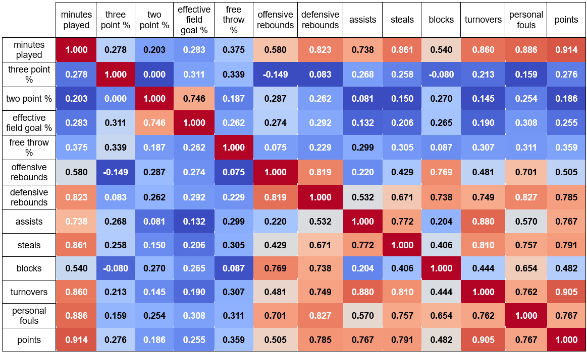
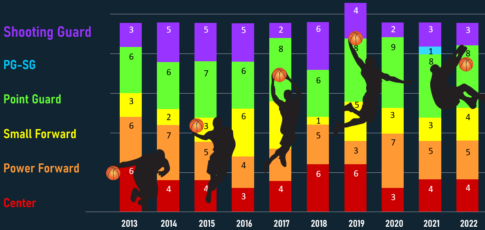
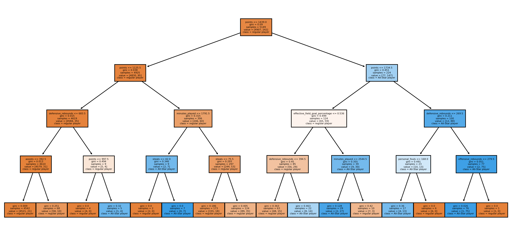
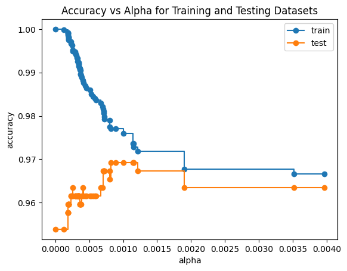
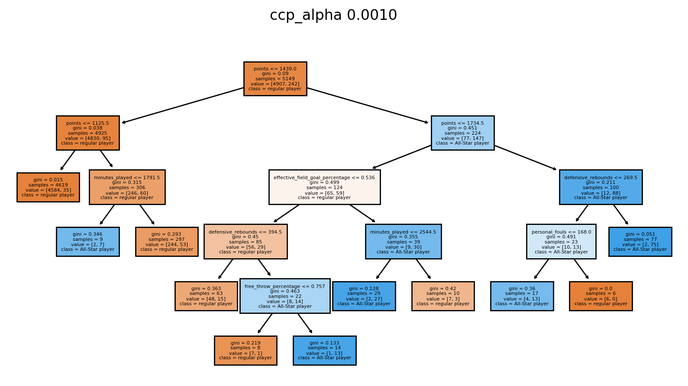
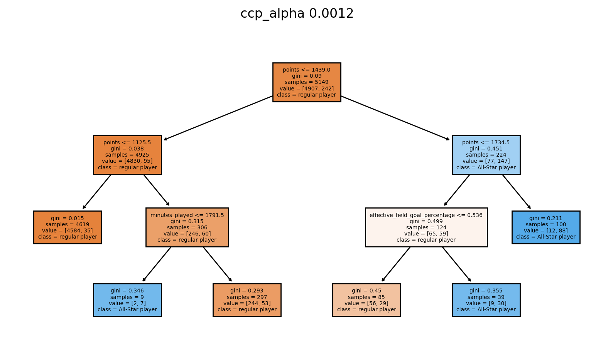
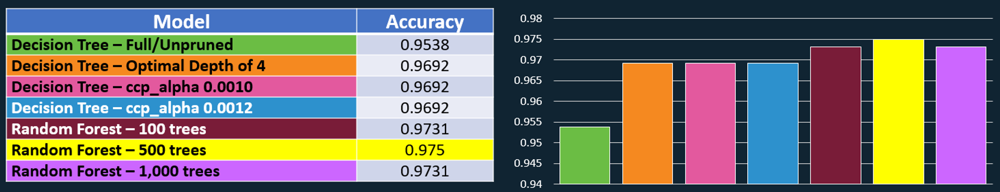

# Decision Trees & Random Forests Predict 2023 NBA All-Stars
This project will attempt to discover observed variables that are associated with past NBA All-Star Teams to predict the 2022-2023 NBA All-Star Team through three variations of decision tree and of random forest modeling.    

## Dataset
The NBA datasets (`training set` and `test set for prediction`) were provided by a university professor, who collected and cleaned some of the messy/conflicting information as a courtesy to the class. 

The training dataset has 5149 observations from years 2012-2022 across 32 columns/features.  The dependent variable was `all_star`, a dichotomous variable, where 1 denoted All-Star and 0 did not.  The testing dataset had 520 rows/observations from years 2022-2023 across 31 columns/features.  

After several group discussions for feature reduction, 13 independent variables were used in the modeling (`minutes_played`, `three_point_percentage`, `two_point_percentage`, `effective_field_goal_percentage`, `free_throw_percentage`, `offensive_rebounds`, `defensive_rebounds`, `assists`, `steals`, `blocks`, `turnovers`, `personal_fouls`, and `points`).

Discussions also surrounded strongly correlated variables within the correlation heatmap, eventually determined to be as expected.  For example, `points` and `minutes_played` were strongly correlated; the more minutes you play, the greater the opportunity to score points.  Similarly, all the more time to accumulate personal fouls, assists, and rebounds.

Strong correlations can be an issue with regression analysis; however, decision trees can handle *some* irrelevant, redundant, and/or interactions among attributes.  The group decided to keep the 13 independent variables for analysis.

Out of curiosity, we mapped the past All-Stars by position to determine if there were a pattern or requirement (e.g., x-number of shooting guards or point guards), but the number of All-Stars fluctuated by position across the years.

## Decision Trees

A decision tree is flexible and easy to understand.  As a nonparametric approach for classification, it does not require prior assumptions about the probability distribution.  This was particularly useful for this dataset as the distributions on the variables varied.  And, it does not need normalization.  

### **Unpruned Decision Tree**
More leaves can represent a more complex decision boundary than trees with fewer leaves, but an overly complex model may not generalize well with unseen instances (Tan et al., 2019).

### **Optimal Max-Depth Pruned Decision Tree**
In order to reduce the depth of the decision tree, we used `GridSearchCV` to build trees ranging in depth from 1 to 13, compare training accuracy of each tree, and then select the model that produced the highest training accuracy.  

### **Cost-Complexity-Alpha (CCP) Pruned Decision Tree**

When `ccp_alpha` is set to zero, the tree overfits; think the first decision tree and its many leaves/nodes.  As alpha increases, the decision tree may generalize better because more of the tree is pruned.  In the graph above, setting an alpha around 0.0010 maximizes the testing accuracy; however, the greater the alpha the fewer the nodes.  For example, a decision tree with `ccp_alpha` = 0.0010 has 5 levels and an accuracy of 0.97.

But a decision tree with `ccp_alpha` = 0.0012 has 3 levels.

Any further pruning (by reducing alpha) and we risk losing accuracy and risk underfitting.

## Random Forests 100/500/1,000 Trees

>When it comes to prediction, however, harnessing the results from multiple trees is typically more powerful than just using a single tree (Bruce et al., 2020, p. 258).  

The random forest can produce superior predictive accuracy but the advantages of a single tree may be lost.

The random forest bootstraps the training dataset to construct an ensemble of decorrelated decision trees.  In addition to sampling the observations, it randomly samples the variables/features.  Decorrelation was another reason the highly correlated variables were kept for analysis, per group discussion.

### **Feature Importance**
Feature importance fluctuated slightly and changed rankings rarely between random forest models.  Generally, `points`, `turnovers`, and `assists` were most important to the models.

## Conclusion

The random forest with 500 trees held the highest predictive accuracy at 97.5%; however, only 21 players were predicted.  If we examine the next couple of players whose majority vote was closest to being an “All-Star” (class 1), we add Jrue Holiday, Bam Adebayo, and Trae Young to the roster.  This changes the accuracy from 97.5 to 97.7%.

The decision trees (even the pruned ones) held lower predictive accuracy than the random forests.    

## Reference
Bruce, P., Bruce, A., & Gedeck, P. (2020). *Practical statistics for data scientists: 50+ essential concepts using R and Python* (2nd ed.). O’Reilly.

Tan, P-N., Steinbach, M., Karpatne, A., & Kumar, V. (2019). *Data mining* (2nd ed.). Pearson.

## License
MIT
